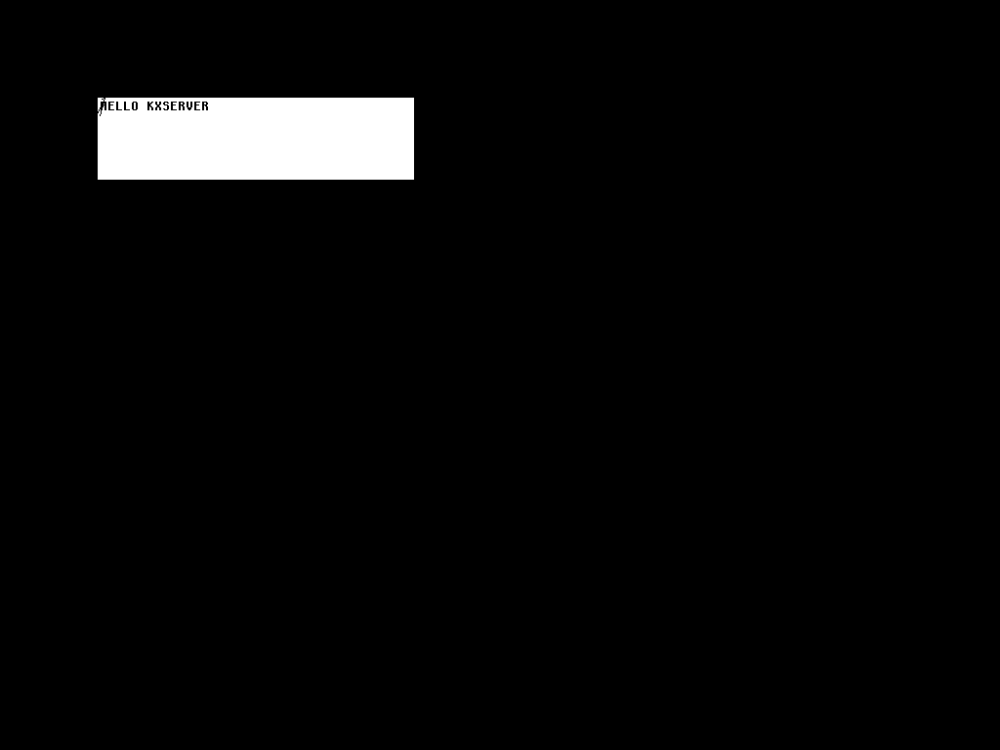

# Blog 173: kxserver Phase 12 — First Real X Clients, First Real xterm

**Date:** 2026-04-13

## What changed

Phase 12 stopped being a feature-building phase. The Python smoke
tests got us to ~77 core opcodes + RENDER + XFIXES, which by the
end of Phase 11 I was no longer convinced were testing the right
thing — Python is too permissive about wire layouts. The real test
is running unmodified Xorg client binaries from the system package
manager, because they exercise every edge case that Xlib and libxcb
care about.

Phase 12 is a loop:

1. Pick a real X client.
2. Run it against **Xvfb** (reference) and **kxserver** (our
   implementation) in parallel through a tiny diff harness.
3. When kxserver fails, read its `--log=req` trace, find the
   offending opcode, implement or fix.
4. Goto 1.

The diff harness is `tools/kxserver/scripts/diff-client.sh`. It
starts Xvfb on `:91` and kxserver on `:92`, runs any client
against both, captures kxserver's request-level log, and reports
whether each succeeded. A `BOTH SUCCEEDED` line is the only pass
condition — and for Phase 12's first day, we got it on:

- **xdpyinfo**  — 10 requests, prints full display info
- **xsetroot -solid red** — 13 requests, root background set
- **xset q** — 14 requests (after one round of fixes)
- **xrdb -query** — 8 requests
- **xterm -fn fixed -e /bin/true** — **383 requests**
- **xterm -fn fixed -e 'printf HELLO KXSERVER'** — pixels on the
  screen, captured as `Documentation/blog/images/phase12-xterm-hello.png`

## The first real xterm output

Here is what kxserver's shadow framebuffer looked like after a real
Arch Linux xterm drew `HELLO KXSERVER` into a 40×5 terminal:



That image came out of `--ppm-on-exit` and was `convert`ed to PNG.
The white rectangle is xterm's terminal area at window-local
(100, 100), size 324×84 (exactly 40×5 cells + ~4px of chrome), the
text is `HELLO KXSERVER` rendered via core X11 `ImageText8` with
our 8×16 bitmap font, and the little `/` notch at the top-left is
the 5-point `PolyLine` xterm draws as its scrollbar divider.

Pixel accounting in the xterm area: 26,778 white pixels (background),
17,222 black pixels (text + cursor + scrollbar divider). On 9
consecutive rows (y=104..112) there are 40–60 black pixels each —
which is exactly what you'd expect from a row of fixed-width 8×16
glyphs where each character averages about 3 black pixels per
horizontal strip of the letter.

## What the log looked like

Representative tail of the 383-request trace:

```
[C1 #0001] REQ op=98  QueryExtension       len=20 data=0x00
[C1 #0001] REP ok QueryExtension "BIG-REQUESTS" → present=1
[C1 #0002] REQ op=128 BigReqEnable         len=4 data=0x00
[C1 #0002] REP ok BigReqEnable → max_len=262144 words
[C1 #0003] REQ op=55  CreateGC             len=20 data=0x00
...
[C1 #0040] REQ op=16  InternAtom           len=32 data=0x00
[C1 #0040] REP ok InternAtom name="_NET_SUPPORTING_WM_CHECK" only_if_exists=false
[C1 #0047] REQ op=16  InternAtom           len=32 data=0x00
[C1 #0047] REP ok InternAtom name="_NET_WM_STATE_FULLSCREEN"
...
[C1 #0371] REQ op=76  ImageText8           len=96 data=0x50
[C1 #0371] REP ok ImageText8 wid=0x200015 n=80 @(2,223)
[C1 #0372] REP ok ImageText8 wid=0x200015 n=80 @(2,239)
...
[C1 #0383] REQ op=65  PolyLine             len=32 data=0x01
[C1 #0383] REP ok PolyLine wid=0x200015 n=5
```

Forty-something `_NET_*` atom interns (ICCCM/EWMH boilerplate),
pixmap allocations at multiple depths, GC creation, window attribute
changes, a full row of `ImageText8` per terminal line, and a
scrollbar `PolyLine`. Every request replied OK.

## The fixes Phase 12 needed so far

### 1. Missing miscellaneous request handlers (106, 108, 105, 107, 109–113, 115)

`xset q` crashed on `GetPointerControl (106)` and
`GetScreenSaver (108)`. Rather than implement one at a time I
added the whole `xset`/`xterm`/`xfce` "miscellaneous query/control"
batch in one pass:

- 105 ChangePointerControl (stub)
- 106 GetPointerControl (returns 1/1 accel, 0 threshold)
- 107 SetScreenSaver (stub)
- 108 GetScreenSaver (returns disabled)
- 109 ChangeHosts (stub, we don't do access control)
- 110 ListHosts (returns empty list, access enabled)
- 111 SetAccessControl (stub)
- 112 SetCloseDownMode (stub)
- 113 KillClient (stub)
- 115 ForceScreenSaver (stub)

These are all trivial wire-level replies — the server either
echoes back defaults or accepts a no-op. But missing any one of
them makes the client abort, so they're load-bearing despite being
uninteresting.

### 2. CreatePixmap rejected non-24/non-32 depths

xterm creates depth-1 pixmaps for cursor masks, bitmap glyph
caches, and the font's per-character coverage bitmap. Phase 5's
original `handle_create_pixmap` hard-coded "depths 24 or 32 only":

```rust
if depth != 24 && depth != 32 {
    send_error(c, errcode::BAD_MATCH, ...);
    return true;
}
```

Relaxed to `1 | 4 | 8 | 16 | 24 | 32` — every depth we advertise in
the connection setup. Pixmap storage remains u32-per-pixel; the
depth just drives how subsequent PutImage / CopyPlane / RENDER
requests interpret the contents.

### 3. PutImage silently dropped XYBitmap / XYPixmap

Phase 5 only implemented ZPixmap at depth 24 and warned-and-dropped
everything else. xterm uploads XYBitmap (format=0) data constantly
for its cursor masks and font caches. I extended `handle_put_image`
to decode:

- **Format 0 / 1 (XYBitmap / XYPixmap):** 1 bit per pixel, row-
  padded to 4 bytes, little-endian bit order within a byte. Expand
  each bit to 0 or 0xFFFFFFFF on the way into the pixmap.
- **Format 2 (ZPixmap):** Now handles depths 1, 8, 16, 24, 32 with
  per-depth row-stride arithmetic, not just depth 24.

After those three fixes, `xterm -fn fixed -e /bin/true` got all
383 requests through cleanly, and the second `xterm -e
'printf HELLO KXSERVER'` invocation actually drew the text.

## Opcode count after Phase 12 day 1

- Core X11: **88 opcodes implemented** (was 77 at end of Phase 11;
  added 10 from the xset batch, and fixed PutImage + CreatePixmap).
- Extensions: BIG-REQUESTS (1), RENDER (13), XFIXES (16).
- Total: **118 distinct request handlers**.

## What's next

The harness works, the loop works, and the first real terminal
runs. The next clients in the escalation ladder:

1. **xterm with a real interactive shell** — see if keyboard input
   works via the injected-input path, and whether copy/paste hits
   the selection code. Keyboard input is still gated by the Kevlar-
   only `INPUT_TODO.md` diagnostic for actual `/dev/input/event0`
   bytes; on the host dev environment we'll need to drive it via
   `--inject=key:KC:down` or a synthetic event path.
2. **A tiny GTK3 hello-world** — this is where Cairo's RENDER path
   gets exercised for real, including glyph uploads via Xft.
3. **xfce4-panel**, eventually.

Every new client surface a new batch of "missing opcode X" or
"reply layout Y off by 4 bytes" diagnostics. And every one lands
as a Rust change we wrote ourselves, not a mystery inside a
200-kLOC C codebase. That was the whole point of Phase 0–11, and
Phase 12 is the first phase where it actually pays off.

## Regression runs

- `cargo build --release`: clean.
- `cargo test --release`: **36/36 unit tests pass** (region,
  render_ext, setup, wire).
- Phase 4–11 host smoke tests: **all 8 PASS**.
- `make test-threads-smp`: **14/14 PASS**.
- Diff-harness clients: xdpyinfo, xsetroot, xset, xrdb, xterm —
  **all BOTH SUCCEEDED**.
