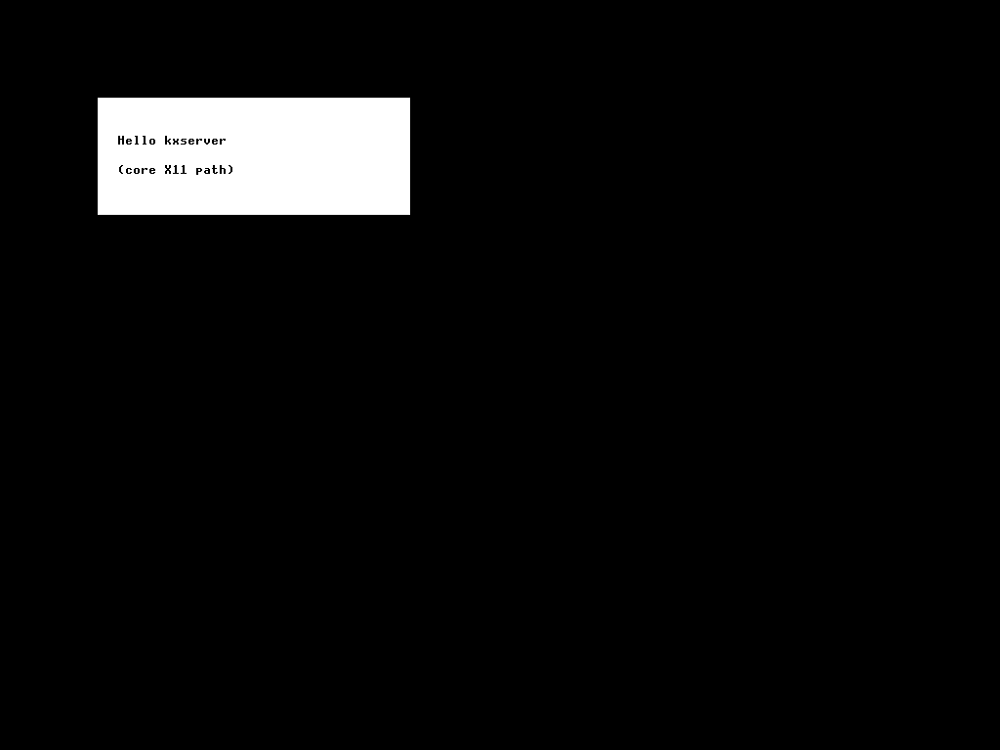
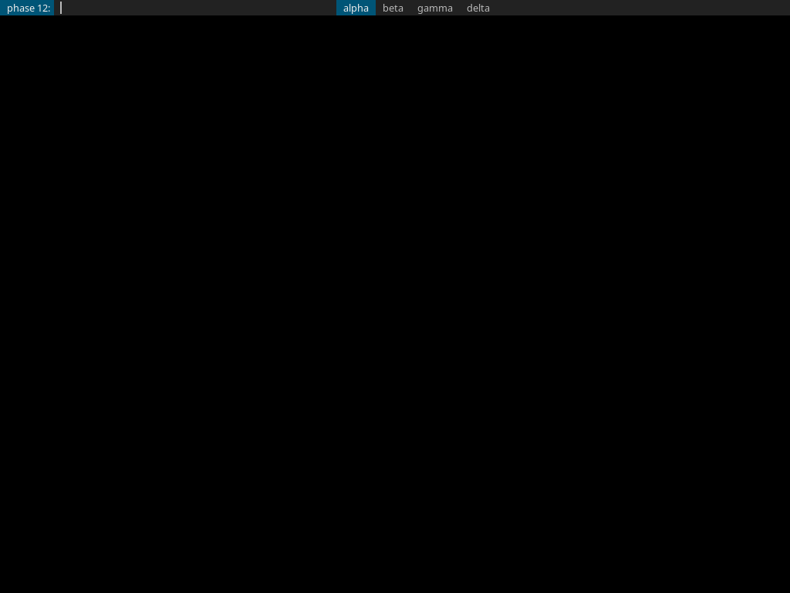
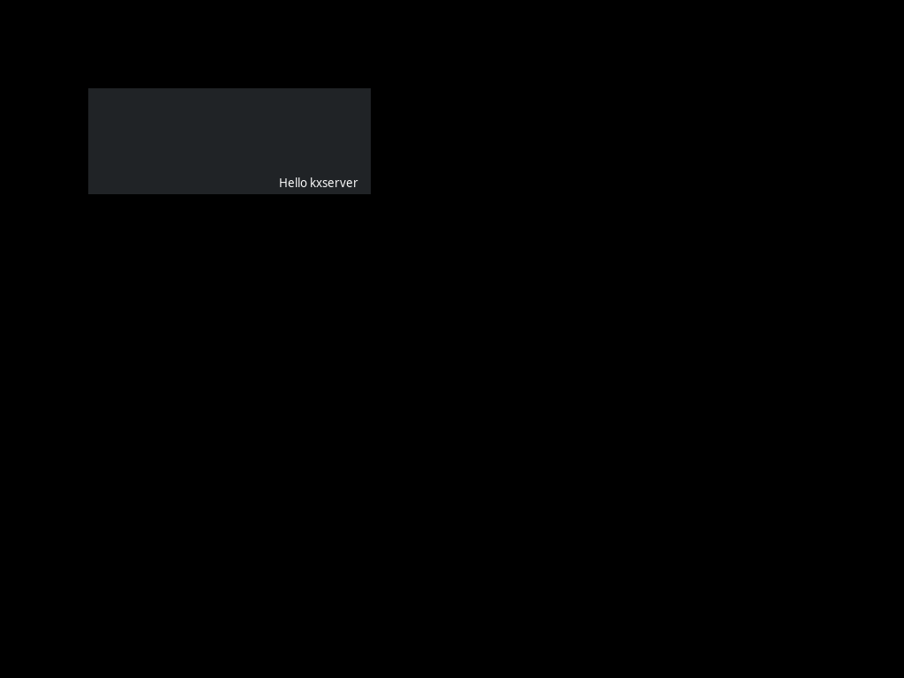

# Blog 174: kxserver Phase 12 — Real Xlib, Real dmenu, Real GTK3

**Date:** 2026-04-13

## What landed

Phase 12 continues the "drive real X clients, fix what breaks"
loop. Three new sub-phases shipped in one session:

- **Phase 12.1**: a raw Xlib C hello-world program — no toolkit, no
  Xft, just `XCreateSimpleWindow + XDrawString` on the default GC.
- **Phase 12.2**: real `dmenu` from `community/dmenu`, exercising
  the Xft → freetype → RENDER glyph-upload → CompositeGlyphs8
  pipeline against a real production binary for the first time.
- **Phase 12.3**: a minimal **GTK3** hello-world. 191 requests
  through kxserver, dark Adwaita window with antialiased
  "Hello kxserver" text rendered.

By the end of Phase 12.3, six real X clients run cleanly against
kxserver: `xdpyinfo`, `xsetroot`, `xset`, `xrdb`, `xterm`,
`xmessage`, `dmenu`, `xlib_hello`, `gtk3_hello`.

## The visible payoff

Phase 12.1 — raw Xlib:



Phase 12.2 — dmenu:



You can see the four menu items `alpha beta gamma delta` (with
`alpha` highlighted in dmenu's selected-item teal), the prompt
`phase 12:`, and the input cursor — all rendered through Xft via
real freetype glyph uploads.

Phase 12.3 — GTK3:



A real GTK3 toplevel with the dark Adwaita theme, displaying
`Hello kxserver`. 143 unique colors in the bbox — that's
antialiased grayscale from Cairo + Pango + freetype, blended
through our RENDER `over_pixel_masked`.

## Load-bearing bugs Phase 12 surfaced

### 1. MapWindow didn't paint the background pixel

Phase 3 generated `Expose` after `MapWindow` but never actually
painted the window. xterm's `ImageText8` includes its own bg fill,
so it didn't notice. xlib_hello's `XDrawString` uses GXcopy with
just a foreground color — and the background was undefined-but-
happened-to-be-zero, which means **black text on black**, invisible.

Fix: paint `bg_pixel` over the entire window in
`handle_map_window` before delivering Expose.

```rust
let bg_pixel = state.resources.window(wid).map(|w| w.bg_pixel).unwrap_or(0);
let abs = abs_origin(state, wid);
if let Some(clip) = window_clip(state, wid) {
    render::fill_rect_window(&mut state.fb, abs, clip, 0, 0, w_, h_, bg_pixel);
}
// ...then Expose
```

This is the X11 spec recommended behavior; my Phase 3 version was
technically allowed to leave contents undefined, but every real
client depends on the painted-bg version.

### 2. RENDER request wire layout — `op` is not in `hdr.data`

This was the load-bearing bug. Every X11 extension request has
`hdr.data` (byte 1) carrying the **minor opcode**, not a free data
byte. For RENDER `Composite`, `CompositeGlyphs8`, and
`FillRectangles`, the Porter-Duff operator lives at **byte 4 of the
body**, with 3 bytes of padding before the actual arguments. My
Phase 10 implementation read `op` from `hdr.data` and arguments
starting at byte 4 — wrong on both counts.

The Phase 10 smoke test passed because the test sent the same wrong
layout the server expected. dmenu sent the **correct** layout, the
server read `src=3` where it should have read `op=3`, and
everything below the operator unraveled.

Fix in three handlers, plus retroactive corrections in the Phase 10
and Phase 11 Python tests.

### 3. PolyFillRectangle rejected pixmap targets

dmenu double-buffers: it fills an offscreen pixmap with the bg
color, composites glyphs onto the pixmap, then `CopyArea`s the
pixmap to the window. My `fetch_draw_context` required the target
to be a window, so every `PolyFillRectangle` on the dmenu pixmap
errored with `BadDrawable`.

Fix: relax to `is_drawable` (window OR pixmap), and add
`fill_rect_drawable` that branches between framebuffer write and
pixmap pixel buffer.

### 4. RENDER pixel writes ignored pixmap destinations

Same root issue as #3 but worse — `Composite`, `CompositeGlyphs8`,
and `FillRectangles` all wrote pixels straight to `state.fb`
without checking whether the picture's destination drawable was a
pixmap. dmenu's entire glyph rendering went into nowhere because
the destination picture wrapped a pixmap.

Fix: introduced a `RenderDst` snapshot and two helpers,
`render_read_pixel` / `render_write_pixel`, that dispatch on
pixmap-vs-window for every per-pixel access. All three RENDER
drawing handlers now go through them. After this fix, dmenu went
from showing only a teal selection bar to showing the full text.

### 5. CreatePixmap rejected non-24/32 depths

xterm uses depth-1 pixmaps for cursor masks and bitmap glyph
caches. Phase 5 hardcoded depths 24 and 32 only. Relaxed to
`1 | 4 | 8 | 16 | 24 | 32`.

### 6. PutImage silently dropped XYBitmap / XYPixmap

Phase 5 only decoded ZPixmap at depth 24. Real xterm uploads
XYBitmap (format=0) constantly. Extended `handle_put_image` to
decode XYBitmap, XYPixmap, and ZPixmap at depths 1/8/16/24/32 with
per-depth row-stride arithmetic.

### 7. Missing miscellaneous core opcodes (105–115)

`xset q` needs `GetPointerControl` (106) and `GetScreenSaver`
(108); a few other clients need the rest of the 105-115 range.
Implemented the full batch as either real replies or stubs.

### 8. RENDER CreateCursor (27) and XFIXES SetCursorName (23)

xmessage probes for cursor-image requests. Both stubbed.

### 9. TranslateCoordinates (40)

GTK3's first call after creating a toplevel is `XTranslateCoordinates`
to map between window-local and root coordinates for ICCCM
positioning. Implemented the obvious version: walk both windows'
parent chains via `abs_origin`, subtract.

## Opcode count after Phase 12.3

- Core X11: **89 opcodes implemented** (was 88; +TranslateCoordinates)
- Extensions: BIG-REQUESTS (1), RENDER (14), XFIXES (17)
- Total: **121 distinct request handlers**

## What's next

Phase 12.4 is `xfwm4` standalone — the actual XFCE window manager.
Phase 12.5 is the destination: `xfdesktop + xfce4-panel` running
against kxserver. Both need installing
`xfwm4 xfce4-panel xfdesktop` from `extra` first.

After that, the loop pivots back to Kevlar: take the same kxserver
binary that runs GTK3 on the dev host and boot it inside Kevlar's
Alpine image. The whole point of Phase 12 was to be confident that
the wire-protocol surface is right *before* we hit Kevlar's own
input/device-integration issues.

## Regression runs

- Phase 4–11 host smoke tests (with the Python tests updated for
  the corrected RENDER wire layout): **8/8 PASS**.
- `cargo test --release`: **36/36 unit tests pass**.
- `make test-threads-smp`: **14/14 PASS** — no kernel changes.
- Real client matrix: xdpyinfo, xsetroot, xset, xrdb, xterm,
  xmessage, dmenu, xlib_hello, gtk3_hello — **all BOTH SUCCEEDED**
  via the diff harness.
