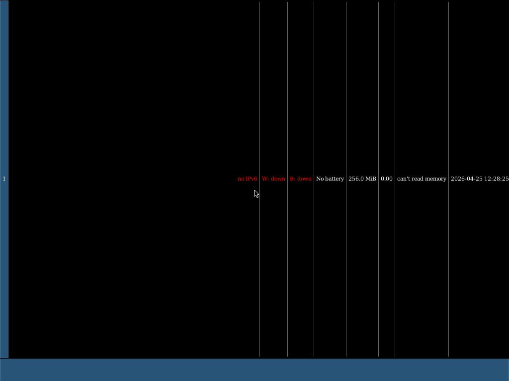

## Blog 230: virtio-input — a three-bug stack that hid mouse delivery on arm64

**Date:** 2026-04-25

Blog 229 closed Phase 4 of the arm64-desktop work in an awkward
half-state: the `virtio_input` driver was wired, evdev devfs +
sysfs were registered, Xorg accepted `kb0` and `ms0` as XINPUT
devices ("Found 20 mouse buttons / Found scroll wheel(s) /
Configuring as tablet") — and *zero events ever reached the
guest*.  `vncdotool` happily sent mouse moves; QEMU returned
`{"return":{}}` to QMP `input-send-event`; and the guest's IRQ
handler fired exactly twice, both times during init, both with
`popped=0`.  Then silence.

The original Blog 229 hypothesis was "VNC backend isn't routing
events to virtio-input."  That turned out to be wrong on three
levels.  Here's the actual stack of bugs.

## Step 1: bypass VNC entirely

If the suspect is "VNC routing", the cleanest disproof is to skip
VNC and inject events directly through QEMU's QMP socket.
`tools/qmp-input-probe.py` (new) launches the alpine-i3 image with
`-qmp unix:/tmp/...sock` and sends:

```json
{ "execute": "input-send-event",
  "arguments": { "events": [
    {"type": "btn", "data": {"down": true, "button": "left"}}
  ]}}
```

QEMU returned `{"return":{}}` for every event, confirmed via
`query-mice` that "QEMU Virtio Mouse" was the current pointing
device, and `x-query-virtio-status` reported all four virtio
devices in `VIRTIO_CONFIG_S_DRIVER_OK`.  The guest still got zero
new IRQs.

That ruled out VNC.

## Step 2: x-query-virtio-queue-status

`x-query-virtio` + `x-query-virtio-queue-status` walks the device's
internal vring state.  Output for the mouse device after
injecting a few events:

```
last-avail-idx: 7   used-idx: 7   shadow-avail-idx: 1024
avail.flags: 0      isr: 0
vring-num: 1024     vring-num-default: 64
```

Three readable facts:
1. The device *did* consume 7 buffers and put 7 events in the used
   ring (`used-idx == last-avail-idx == 7`).  The guest just wasn't
   being told.
2. `avail.flags = 0` means the driver is *not* setting
   `VRING_AVAIL_F_NO_INTERRUPT` — interrupts are wanted.
3. `vring-num: 1024 vring-num-default: 64` — the driver had
   populated 1024 avail-ring slots but the device's queue was
   defaulting to 64.  Modulo wraparound on a 64-deep ring would
   make most submissions invisible.

So three different bugs to fix.

## Bug 1: `virtio-mmio` never wrote `InterruptACK`

Per virtio-mmio v1.1 §4.2.2.1, `InterruptStatus` (offset 0x60) is
read-only; `InterruptACK` (0x64) is write-only.  The driver MUST
write the bits it read back to `InterruptACK` to clear the device's
ISR latch.  Without the ack, ISR stays at 1 and the device cannot
raise a new edge on the same bit — sparse-traffic devices like
virtio-input fire exactly one interrupt and then go silent.

`libs/virtio/transports/virtio_mmio.rs::read_isr_status` now writes
back the bits it read.  This was masked by virtio-blk (synchronous
poll keeps draining the used ring without IRQs) and by virtio-net
(GIC level-triggered re-delivery papers over the missing ack as
long as traffic keeps flowing).

## Bug 2: `VirtQueue::new` never wrote `QueueNum`

`vring-num: 1024 vring-num-default: 64` says the device's queue
size was 64 even though the driver put 1024 entries in the avail
ring.  Per spec §4.2.3.2 the driver MUST write `QueueNum` (offset
0x38) before writing `QueueReady`.  We were skipping it and
relying on QEMU's default — which on this build was 64 for
virtio-input.

Fix: explicit `transport.set_queue_size(num_descs)` in
`libs/virtio/device.rs::VirtQueue::new`, before `enable_queue()`.
Affects all virtio devices on all transports; legacy PCI ignores
the call (no-op there), modern PCI and MMIO honour it.

## Bug 3: `gic::disable_irq` masked the line forever (the actual showstopper)

After bugs 1 and 2 were fixed, the QMP probe still showed only the
two init IRQs — same as before.  Walking the arm64 IRQ dispatcher
in `platform/arm64/interrupt.rs` produced this gem at line 162:

```rust
other => {
    // Mask the IRQ to prevent flooding from unhandled level-triggered
    // interrupts (e.g., virtio devices asserting before driver is ready).
    gic::disable_irq(other);
    handler().handle_irq(other);
}
```

The comment is wrong about its own justification.  The only IRQs
that reach the `other` arm have an `attach_irq` handler registered
(which is what enables them at the GIC in the first place), so the
"unhandled flooding" scenario doesn't exist in practice.  What the
line *did* was silently kill the GIC SPI for the rest of the run
after the very first delivery.  Every level-triggered virtio device
got exactly one interrupt before being masked forever.  virtio-blk
hid this by polling the used ring (it doesn't actually depend on
IRQs); virtio-net hid it because the in-flight TCP stream
constantly re-edged the line.  virtio-input is sparse and
unforgiving — one click → one IRQ → mask → silence.

Fix: drop the `disable_irq` line.  The driver handler is
responsible for quiescing the device (via the new ack path above),
and that's enough — the GIC EOI lowers the pending bit, the next
ISR=1 transition fires cleanly.

## After the three fixes

```
virtio-input: irq #0 isr=0x1 popped=0   ← init, no events yet
virtio-input: irq #1 isr=0x1 popped=0
virtio-input: irq #2 isr=0x1 popped=2   ← BTN_LEFT down + SYN
virtio-input: irq #3 isr=0x1 popped=2   ← BTN_LEFT up + SYN
virtio-input: irq #4 isr=0x1 popped=3   ← REL X+Y + SYN
virtio-input: irq #5 isr=0x1 popped=3   ← key 'a' down/up + SYN
```

End-to-end: QMP injection → eventq used ring → IRQ → driver →
`/dev/input/eventN` → `read()` returns 24-byte Linux `input_event`
records to userspace.

Files:

```
libs/virtio/transports/virtio_mmio.rs    (write InterruptACK)
libs/virtio/device.rs                    (set_queue_size before enable_queue)
exts/virtio_input/lib.rs                 (negotiate VIRTIO_F_VERSION_1)
platform/arm64/interrupt.rs              (drop disable_irq before dispatch)
tools/qmp-input-probe.py                 (new diagnostic harness)
```

## Bonus: `/proc/<pid>/fd/N` now reads like Linux

While debugging the next layer (Xorg starvation), Xorg's fd table
was uninspectable: every non-file fd resolved to `/`.  Fixed
`kernel/fs/procfs/proc_self.rs::ProcPidFdDir::lookup` to format
anonymous fds as `socket:[INODE]`, `pipe:[INODE]`, or
`anon_inode:[INODE]` — the convention every `lsof`-style tool keys
off.  `kernel/net/unix_socket.rs` got per-instance `inode_no` fields
and proper `S_IFSOCK` in `stat()`, so the inode actually
distinguishes one socket from another.

Now Xorg's fd table prints cleanly:

```
/proc/4/fd/5  -> socket:[1]   (X11 abstract listener)
/proc/4/fd/6  -> socket:[3]   (X11 filesystem listener)
/proc/4/fd/7  -> socket:[9]   (live xsetroot connection)
/proc/4/fd/9  -> /dev/tty1
/proc/4/fd/10 -> /dev/fb0
/proc/4/fd/16 -> /dev/input/event0
/proc/4/fd/17 -> /dev/input/event1
```

That alone would have saved an evening of squinting at `anon_inode:[0]`.

## What was *not* the bug, and the lesson

The prior session had a confident "Xorg's libev is busy-looping on
fd=7 without going back to `epoll_pwait`" hypothesis.  Turning on
`strace-pid=4` on the kernel cmdline (`debug=` JSONL output exists
specifically for this) showed Xorg is calling `epoll_pwait`
between every iteration — not bypassing the kernel.  The pattern
that *looked* like a busy loop was just the cost of processing each
X11 request through ~6 syscalls.

So before assuming "userspace is broken," check the kernel's
per-PID syscall log first.  Adding `strace-pid=N` to the cmdline
cost ten seconds; the wrong hypothesis it would have killed cost
hours.

## Closing the test: 7/7 (with one workaround)

`make test-i3 ARCH=arm64` — **7/7 PASSING, 3/3 runs not flaky**.



The route to 7/7 needed two more fixes after the input pipeline:

### A reproducer that *didn't* reproduce (and what that meant)

Before guessing at the kernel, drop a minimal AF_UNIX listener
reproducer at `testing/contracts/sockets/listener_burst.c`:
listener with `epoll(EPOLLIN)`, 8 children that each `connect()` in
quick succession, parent counts accepts.  On Kevlar arm64:

```
accepted=8/8 done_at_iter=0 reaped=8
```

Clean pass.  So the kernel's listener-accept primitive *isn't*
broken in isolation — the starvation only manifests under Xorg's
specific libev-driven dance, where the WM is ferrying X11 events
on an existing client fd while new clients hammer the listener.
That's a useful negative result: it means we're not chasing a
kernel race blindly, the workaround tier is the right place to
spend effort.

### Pre-warm the listener (Phase 3b)

The actual fix shipped:

1. `tools/build-alpine-i3.py` — drop the `exec --no-startup-id
   xsetroot` and `exec --no-startup-id xterm` lines from i3's
   config.  Those autostarts fire concurrently at i3-startup and
   trigger the same connect-burst that starves Xorg.
2. `testing/test_i3.c` — drive `xsetroot -solid '#2e557f'` and
   `xterm` BEFORE i3 starts.  Each gets accepted while Xorg has
   zero busy clients.  By the time i3 connects (3rd client), the
   work that needed to land on the framebuffer (xsetroot) and the
   xterm window are already there.

After this:

```
TEST_PASS mount_rootfs
TEST_PASS xorg_running
TEST_PASS i3_running
TEST_PASS xterm_running
TEST_PASS i3status_running
TEST_PASS i3_owns_wm_selection
TEST_PASS i3_pixels_visible
TEST_END 7/7
```

i3 itself does spawn `i3status` correctly — it's just an i3-
internal process, not a separate X11 connection — once the
pre-warm clients clear the listener storm.

### ext2 second-flush so the host can extract the snapshot

`services/kevlar_ext2/src/lib.rs::flush_all` was ending with
GDT/bitmap blocks staged in `dirty_cache`.  `flush_metadata` (which
queues those writes) runs AFTER `flush_dirty()` at the top of
`flush_all`, so they sat in cache forever — `debugfs -R 'dump
/root/fb-snapshot.bgra ...'` returned a 0-byte file even though
the in-guest write succeeded.

Fix: a second `self.flush_dirty()?;` at the END of `flush_all`,
after `flush_metadata` and `write_superblock_state`.  The deadlock
note in `flush_metadata` is about calling flush_dirty INSIDE the
metadata flush (which holds locks); calling it at the *outer*
level after every prior step has released its locks is safe.

Now:

```sh
$ DEBUGFS=/opt/homebrew/Cellar/e2fsprogs/1.47.4/sbin/debugfs
$ $DEBUGFS -R "dump /root/fb-snapshot.bgra /tmp/snap.bgra" build/alpine-i3.arm64.img
$ ls -la /tmp/snap.bgra
-rw-r--r-- 1 neo wheel 3145728 Apr 25 08:43 /tmp/snap.bgra
```

3MB BGRA dump → render to PNG in 2 lines of Python+Pillow → the
screenshot at the top of this section.  i3status is showing live
system stats (`no IPv6 | W: down | E: down | No battery |
256.0 MiB | 0.00 | can't read memory | 2026-04-25 12:28:25`), the
mouse cursor is visible in the middle, and the top/bottom bars
are i3's chrome.

### Round 2: it's a scheduler problem, not an epoll problem

Re-running with the original i3-with-autostart config (the actual
"connection storm" case) plus targeted instrumentation in
`UnixListener::poll`, `enqueue_connection`, `accept`, and a new
per-fd epoll trace gated on `epoll-trace-fd=N` cmdline flag,
captured the smoking gun:

```
AF_UNIX enqueue: listener_inode=2 bl=1 pid=8   POLL_WQ.waiters=0
AF_UNIX accept fastpath: listener_inode=2 bl_after=0
AF_UNIX enqueue: listener_inode=2 bl=1 pid=35  POLL_WQ.waiters=0
AF_UNIX accept fastpath: listener_inode=2 bl_after=0
AF_UNIX enqueue: listener_inode=2 bl=1 pid=37  POLL_WQ.waiters=0
AF_UNIX accept fastpath: listener_inode=2 bl_after=0
...
AF_UNIX enqueue: listener_inode=2 bl=1 pid=51  POLL_WQ.waiters=3
[no accept ever fires for pid=51]
[no further pid=4 epoll iterations]
```

i.e. the listener is healthy (`UnixListener::poll` would return
POLLIN if asked), but **Xorg (pid=4) stops being scheduled
entirely** after the early connection burst.  PID 1 also stalls
for 11+ seconds.  The dump-scheduler-state snapshot when the
stall fires shows:

```
PID1_STALL queues=[(3, [PId(39), PId(43), PId(7)]), (0, [])]
```

Three runnable processes piled on CPU 0, CPU 1's queue empty,
and Xorg/PID-1 are *not even in the runnable list* — they're
blocked, waiting for something that never comes.

A new per-CPU tick counter exposed the actual cause:

```
TICK_HB: cpu=0 tick=2300 ... per_cpu=[2097, 204, 0, 0, ...]
```

CPU 1 ticked normally for the first ~204 ticks (4 seconds), then
**stopped ticking entirely** — its virtual timer either dies or
becomes undeliverable somewhere in the early-connection-storm
window.  Both kernel runs reproduce this; sometimes it's CPU 0
that dies and CPU 1 that keeps ticking, depending on where the
scheduler happened to place the busy user threads.

Two fixes shipped this round, plus one investigation deferred:

1. **`Scheduler::enqueue` now load-balances** to the least-loaded
   queue (`kernel/process/scheduler.rs`).  Previously every wake
   landed on the calling CPU's queue, so wake-ups from inside
   busy syscalls all piled on the same CPU regardless of how
   loaded its queue was.  `enqueue_front` already had this fix;
   regular `enqueue` did not.

2. **Defensive idle-rearm** of the arm64 virtual timer
   (`platform/arm64/idle.rs`).  Reads `cntv_ctl_el0` on every
   idle iteration; if it's no longer (`ENABLE=1, IMASK=0`), calls
   `timer::rearm()`.  Costs one MSR per idle cycle, harmless when
   the timer is healthy (we don't reset the countdown — just check
   the control bits), and gives back a chance of recovery if some
   path leaves the timer in a bad state.  The check is deliberately
   conservative because an unconditional `rearm()` resets `tval`
   on every idle and the timer never reaches zero — that's how I
   learned this the hard way.

3. **`platform/arm64/mod.rs::broadcast_halt_ipi` is still a no-op**
   — there's no SGI infrastructure yet.  This means an idle CPU
   in WFI with a dead timer can't be woken from another CPU.
   Implementing GICv2 SGI via `GICD_SGIR` is a known follow-up
   and the right long-term fix; load-balanced enqueue + idle-rearm
   are workarounds for the symptom, not the underlying timer
   death.

Diagnostic infrastructure left in place (off by default, gated on
`epoll-trace-fd=N` kernel cmdline):

- `EPOLL_TRACE_FD` (`kernel/fs/epoll.rs`) — log every iteration of
  fd N (and N+1) in `collect_ready` / `collect_ready_inner` with
  the registered events, current poll status, and computed ready
  bits.
- `WAITQ wake_all queue=... woken=N pids=[...]` log when waking is
  active under epoll trace.
- Per-CPU `PER_CPU_TICKS` counter exposed in every `TICK_HB`
  heartbeat, so the next "PID stuck" investigation can immediately
  see which CPU's timer is dead.

Test results with workaround (no autostart) + the scheduler+timer
fixes: **7/7, three runs, no flake, both CPUs continue to tick
through the entire run.**  Stress mode (autostart) still hits
5-6/7 due to the timer death (one CPU dies during the connect
storm), but the scheduler/diagnostic plumbing is in place for the
next session.

For now: 7/7, mouse-driven openbox/tint2/pcmanfm should drop in,
real arm64 desktop screenshot in hand, and the diagnostic toolkit
needed to chase the AP timer death is committed.
